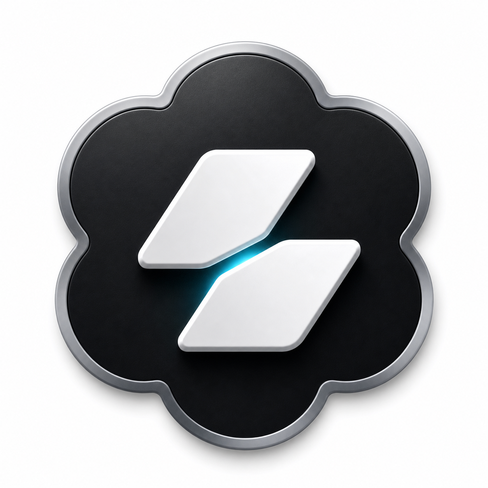
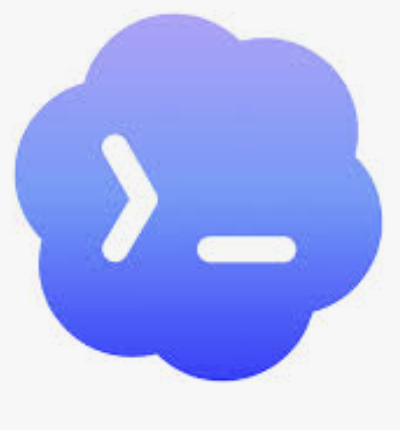
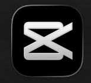

# Codecut Logo 设计规范

## 1. 设计目标

本文定义 Codecut logo 的主设计方向。图 1 是原始图标参考，图 2 和图 3 只作为语义灵感，不作为可复制资产。

本次修订后的核心决策：

- **扁平化是主方向**：Codecut 的正式标志应优先使用扁平图形，适合产品 UI、官网、文档、插件页和小尺寸展示。
- **3D 只是变体**：3D 材质可以作为 app icon、宣传图、启动页的扩展版本，但不能定义主识别系统。
- **花瓣外壳要有动势**：外部花瓣 / 云形外壳不应完全轴对称，应整体轻微旋转，让标志从静态徽章变成“正在执行剪辑动作”的图形。

Codecut 的产品定位是本地 Agent 视频编辑器：Codex 式智能负责理解和生成剪辑计划，CapCut / 剪映式编辑体验负责让结果可视化、可调整、可导出。Logo 需要在第一眼传达这件事：

- 这是 AI Agent 驱动的视频编辑工具，不是普通播放器。
- 它强调剪辑、切割、时间线，而不是单纯生成内容。
- 它是本地、可检查、可控的工作流，不是黑盒云端生成器。
- 它服务高频自媒体创作者，应该专业、清晰、有工具感。

核心判断：Codecut 不靠复制 CapCut 全生态取胜，而是把「AI 理解内容」到「落到可视化时间线」这一步做得更直接、更可控。

## 2. 参考图和方向稿

| 参考 | 作用 | 文件 |
| --- | --- | --- |
| Codecut 原始图标 | 初始设计元素来源：花瓣外壳、黑色底板、白色剪辑片段、青色切线。 | `docs/brand/assets/codecut-original-icon.png` |
| Codex 参考图标 | 提供 Agent、云形外壳、命令感的语义参考。 | `docs/brand/assets/codex-reference-icon.png` |
| CapCut 参考图标 | 提供剪辑、切割、黑底高对比工具感的语义参考。 | `docs/brand/assets/capcut-reference-icon.png` |
| Codecut 扁平动态方向稿 | 本规范推荐的下一版方向：扁平主标志、轻微旋转外壳、保留剪辑切线。 | `docs/brand/assets/codecut-logo-flat-dynamic.svg` |








## 3. 设计概念

Codecut 标志要表达一句话：

> 一个本地 AI 剪辑引擎，正在把内容意图变成一次明确的剪切。

图形由三个语义组成：

1. **Agent 外壳**：外部云形 / 花瓣轮廓来自 Codex 的智能代理感，表达自动化、计算、辅助决策。
2. **剪辑片段**：中间两块白色斜切块来自视频时间线和剪辑片段，表达素材被重新组织。
3. **青色切线**：两块片段之间的青色光线表示 AI 执行动作，也表示剪辑发生的瞬间。

这三个元素缺一不可。只保留云形会像 AI 工具，只保留斜切块会像普通剪辑工具；Codecut 的差异化在于二者的连接。

## 4. 主标志结构

### 扁平主标志

主标志采用扁平图形，由四层组成：

- **动态花瓣外壳**：黑色云形 / 花瓣轮廓，整体轻微旋转，避免完全对称。
- **上剪辑块**：白色斜切块，体积略小，表示被处理的片段。
- **下剪辑块**：白色斜切块，体积略大，承担主要视觉重量。
- **青色切线**：两块之间的青色间隔，是 Codecut 的核心识别点。

主标志用于官网、产品 UI、插件页、文档、社交头像和默认 app icon。

### 3D 变体

3D 版本只作为扩展资产使用，不作为主标志规则。

适合使用 3D 变体的场景：

- 高分辨率 app icon；
- 启动页；
- 品牌宣传图；
- 大尺寸社交封面；
- 发布物料中的视觉焦点。

不适合使用 3D 变体的场景：

- 产品侧边栏；
- 工具栏；
- favicon；
- 文档内嵌 logo；
- 官网导航；
- 任何小于 `64px` 的 UI 场景。

### 字标组合

默认字标为：

```text
Codecut
```

统一使用 `Codecut`。不要在 logo 锁定组合中使用 `CodeCut`、`Code Cut`、`CUTIA` 或中文名，除非后续有单独命名决策。

推荐组合方式：

- **横向组合**：图标在左，字标在右，适合官网导航、文档页眉、插件介绍页。
- **上下组合**：图标在上，字标在下，适合封面、海报、启动页。
- **纯图标**：适合 app icon、头像、favicon、dock icon。

## 5. 构图规范

生产主文件建议使用 `1024 x 1024` 方形画布；应用内 SVG 可以使用 `512 x 512` viewBox 输出。

### 外壳比例

- 外部花瓣外壳占画布宽度约 `82%` 到 `88%`。
- 外壳使用单一扁平深色，不使用金属边框作为主结构。
- 花瓣数量建议保持 `7` 到 `8` 个，保证延续 Codex 式 Agent 外壳语义。
- 花瓣大小可以有轻微差异，避免机械对称。
- 外壳整体建议旋转 `-6deg` 到 `-12deg`，推荐值为 `-8deg`。

### 剪辑片段比例

- 上剪辑块必须小于下剪辑块，形成方向和层次，避免像静态等号。
- 两块剪辑片段应从左下向右上倾斜，形成向前推进的动势。
- 青色切线在 `64px` 下必须清晰，在 `32px` 下仍应可辨认。
- 两块剪辑片段不能贴合。中间的切线是 Codecut 的主要识别资产。

### 几何规则

- 青色切线应靠近视觉中心，而不是机械地放在数学中心。
- 剪辑块角部要圆润，但不能圆成胶囊形。
- 下剪辑块的视觉重量应略高于上剪辑块。
- 不要形成明确的 `X`。一旦读成 `X`，就会过度接近 CapCut。
- 不要让花瓣外壳回到完全上下左右对称；对称会削弱“正在执行”的动感。

## 6. 色彩规范

### 核心色板

| Token | Hex | 用途 |
| --- | --- | --- |
| `codecut-ink` | `#0B0F14` | 扁平外壳、深色 app icon 背景、深色 UI 放置。 |
| `codecut-white` | `#F8FAFC` | 剪辑块、浅色字标。 |
| `codecut-cyan` | `#22D3EE` | 主要切线、AI 执行动作、关键强调。 |
| `codecut-cyan-light` | `#7DD3FC` | 辅助切线、高光、悬停强调。 |
| `codecut-rim` | `#9CA3AF` | 仅用于 3D 变体的金属边框高光。 |
| `codecut-rim-dark` | `#4B5563` | 仅用于 3D 变体的金属边框暗部。 |

### 色彩逻辑

- 黑白负责工具感和剪辑感。
- 青色负责 AI 执行动作。
- 金属灰只属于 3D 变体，不进入主品牌色。
- 不建议把紫蓝渐变作为 Codecut 主色。那会过度靠近 Codex，同时削弱视频剪辑工具的识别。

### 允许版本

1. **主扁平深色版**：`codecut-ink` 外壳、白色剪辑块、青色切线。
2. **浅色扁平版**：透明或白底、黑色外壳、黑色或深色剪辑块、青色切线。
3. **深色单色版**：全黑。
4. **浅色单色版**：全白。
5. **3D 扩展版**：黑底板、金属边、白色剪辑块、青色切线，仅用于大尺寸品牌场景。

除以上版本外，不新增任意配色。需要新增时，先更新本文档。

## 7. 安全距离和最小尺寸

以剪辑块高度为基础单位 `X`。

- 纯图标四周最小安全距离：`0.75X`。
- 横向组合四周最小安全距离：`1X`。
- app icon 最小导出尺寸：`1024 x 1024`。
- 产品内图标最小使用尺寸：`24 x 24`。
- 横向 logo 组合最小高度：`32px`。
- favicon 必须使用扁平简化版本。

如果目标尺寸下青色切线不可见，应使用加大间隔的扁平简化版本，而不是切回 3D 版本。

## 8. 使用场景

### App Icon

默认使用扁平主标志。需要更强货架识别时，可以使用 3D 变体，但 3D 变体不能反向影响主标志规范。

### 官网导航

使用扁平横向组合。官网导航需要快速识别和清晰排版，不使用厚重 3D 图标。

### 产品 UI

使用扁平标志。Codecut 编辑器界面应保持安静、聚焦、工作流优先，logo 不应抢占预览区、时间线或工具按钮的视觉层级。

### 社交头像

优先使用扁平主标志。大尺寸头像或发布物料可以使用 3D 变体。

### 文档

使用扁平标志或横向字标组合。文档场景优先保证阅读效率。

## 9. 动效规范

如果做 logo 动效，只表达一个动作：

1. 花瓣外壳以轻微旋转角进入稳定位置。
2. 两块剪辑片段滑入位置。
3. 青色切线闪烁一次。
4. 标志稳定停住。

总时长控制在 `800ms` 以内。不要让青色光持续循环闪烁；持续发光会让工具显得装饰化，不够克制。

## 10. 禁止用法

禁止：

- 直接复制 Codex 云形轮廓；
- 直接复制 CapCut 的 `X` 结构；
- 使用 Codex 或 CapCut 官方字标；
- 暗示与 OpenAI、Codex、ByteDance、CapCut、剪映存在官方合作；
- 把 3D 版本当作唯一主标志；
- 把花瓣外壳做成完全轴对称；
- 把剪辑块改成播放按钮；
- 删除青色切线；
- 随意替换青色为其他强调色；
- 在 icon 内加入 slogan；
- 把 3D 变体用于很小的工具栏图标；
- 在复杂视频画面上裸放 logo；
- 拉伸、倾斜、随意旋转 logo；
- 额外添加剪刀、胶片、星光、命令行提示符等符号。

## 11. 资产命名

生产资产使用稳定命名，避免后续在 app、文档、插件页面中靠人工猜文件。

```text
codecut-logo-primary-flat.svg
codecut-logo-primary-flat-1024.png
codecut-logo-primary-flat-512.png
codecut-logo-flat-light.svg
codecut-logo-mark-mono-dark.svg
codecut-logo-mark-mono-light.svg
codecut-logo-lockup-horizontal-dark.svg
codecut-logo-lockup-horizontal-light.svg
codecut-logo-variant-3d-1024.png
```

当前方向稿文件：

```text
docs/brand/assets/codecut-logo-flat-dynamic.svg
```

正式上线资产应放在现有目录：

```text
apps/web/public/logos/codecut/
```

本文档和参考图放在：

```text
docs/brand/
```

## 12. 验收标准

一个 logo 资产只有同时满足以下条件，才可以进入产品：

- 主版本是扁平图形，而不是 3D 图标。
- 外部花瓣外壳存在轻微旋转动势，不能完全轴对称。
- 保留两块剪辑片段的核心结构。
- 彩色版本保留可见青色切线。
- 不会被读成 CapCut 的 `X`。
- 不会被读成 Codex 云命令图标。
- `32px` 下仍能识别。
- 有单色版本，支持法务、印刷和单色环境。
- SVG 版本包含可访问性元信息。
- 已在深色、浅色、透明背景下检查。
- 文件名符合本文档的资产命名规则。

## 13. 当前决策

Codecut 以图 1 的设计元素作为来源，但不继续沿用 3D 作为主方向：

- **保留**：Agent 花瓣外壳、黑色工具感、白色剪辑片段、青色切线。
- **改进**：主标志扁平化；花瓣外壳整体旋转约 `-8deg`，让图形更有动势。
- **限制**：3D 只作为大尺寸变体；主识别系统必须从扁平版本出发。
- **避免**：Codex 云形克隆、CapCut `X` 克隆、额外 AI 装饰符号。

下一步生产动作是基于扁平动态方向稿输出一套干净资产：主扁平 SVG、浅色 SVG、单色 SVG、横向字标组合，以及可选 3D 变体。
